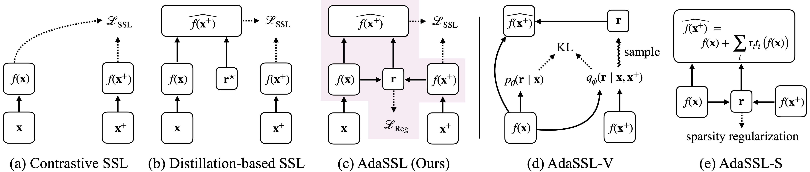

# Self-supervised learning from structural invariance
This is the *PyTorch implementation* for our paper appearing at **ICLR 2026**:


>**[Self-supervised learning from structural invariance](https://openreview.net/forum?id=r3JUDAYjIH)**\
>Yipeng Zhang, Hafez Ghaemi, Jungyoon Lee, Shahab Bakhtiari, Eilif B. Muller, Laurent Charlin


**Abstract.** *Joint-embedding self-supervised learning (SSL)*, the key paradigm for unsupervised representation learning from visual data, learns from invariances between semantically-related data pairs. We study the one-to-many mapping problem in SSL, where each datum may be mapped to multiple valid targets. This arises when data pairs come from *naturally* occurring generative processes, e.g., successive video frames. We show that existing methods struggle to flexibly capture this conditional uncertainty. As a remedy, we introduce a latent variable to account for this uncertainty and derive a variational lower bound on the mutual information between paired embeddings. Our derivation yields a simple regularization term for standard SSL objectives. The resulting method, which we call *AdaSSL*, applies to both contrastive and distillation-based SSL objectives, and we empirically show its versatility in disentanglement, fine-grained image understanding, and world modeling on videos.





## Setup 

Please see the example script below for setting up with *Conda*. You need to set up *wandb* following [this guide](https://docs.wandb.ai/quickstart) if you want to use the code as is. You can set `$ROOT_DIR` to your favourite directory.

```bash
conda create -n adassl python=3.11 -y
conda activate adassl

pip install torch==2.3.0 torchvision==0.18.0 --index-url https://download.pytorch.org/whl/cu118
pip install pandas scipy scikit-learn wandb tqdm "numpy<2"
conda install -c conda-forge faiss-cpu==1.9.0

cd $ROOT_DIR
git clone git@github.com:SkrighYZ/AdaSSL.git
```


## Run

Currently, we provide scripts to run AdaSSL on [3DIdent.md](docs/3DIdent.md), [CelebA.md](docs/CelebA.md), and [iNat-1M.md](docs/iNat-1M.md). 


## Acknowledgment

Much of the code was adapted from my continual SSL codebase [SkrighYZ/Osiris](https://github.com/SkrighYZ/Osiris). The 3DIdent dataloading was adapted from [brendel-group/cl-ica](https://github.com/brendel-group/cl-ica). Implementation of the sparsity regularization was inspired by [slachapelle/disentanglement_via_mechanism_sparsity](https://github.com/slachapelle/disentanglement_via_mechanism_sparsity).


## Citation

```bibtex
@inproceedings{zhang2026selfsupervised,
    title={Self-Supervised Learning from Structural Invariance},
    author={Yipeng Zhang and Hafez Ghaemi and Jungyoon Lee and Shahab Bakhtiari and Eilif B. Muller and Laurent Charlin},
    booktitle={The Fourteenth International Conference on Learning Representations},
    year={2026},
    url={https://openreview.net/forum?id=r3JUDAYjIH}
}
```